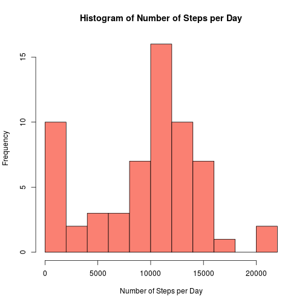
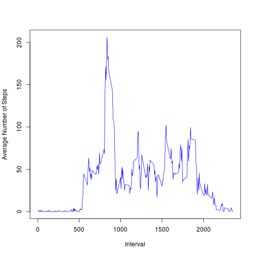
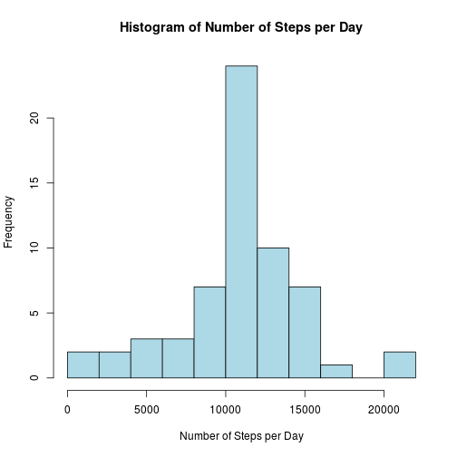
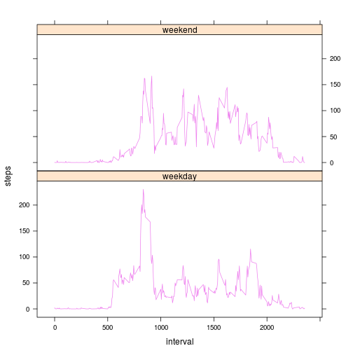

## Loading and preprocessing the data

The repository was first forked and cloned to the working directory from this from this [link](http://github.com/rdpeng/RepData_PeerAssessment1). After that, set the working directory to RepData_PeerAssessment1.

### 1. Load the data


```r
unzip("activity.zip", exdir = "activity")
data <- read.csv("activity/activity.csv", na.strings = "NA")
```

### 2. Preprocess the data


```r
data$date <- as.Date(data$date, format = "%Y-%m-%d")
```

## The mean of total number of steps taken each day

### 1. The total number of steps taken each day


```r
StepPerDay=aggregate(data$steps, list(Date = data$date), sum, na.rm = TRUE)
hist(StepPerDay$x,
     xlab = "Number of Steps per Day",
     main = "Histogram of Number of Steps per Day",
     breaks = 10,
     col = "salmon")
```



### 2. The mean and median total number of steps taken per day


```r
data.frame(Mean = mean(StepPerDay$x, na.rm = TRUE),
           Median = median(StepPerDay$x, na.rm = TRUE))
```

```
##      Mean Median
## 1 9354.23  10395
```

## The average daily activity pattern?

### 1. Time-series plot

The average number of steps taken for each interval (across all days) is plotted in the following time-series plot:


```r
StepPerInterval = aggregate(list(steps = data$steps),
                            by = list(interval = data$interval),
                            FUN = mean,
                            na.rm = TRUE)
plot(StepPerInterval$steps ~ StepPerInterval$interval,
     xlab = "Interval",
     ylab = "Average Number of Steps",
     col = "blue",
     type = "l")
```



### 2. The interval with maximum steps


```r
temp <- round(StepPerInterval[which.max(StepPerInterval$steps),])
```

Among all 5-minute intervals, the interval that has the maximum number of steps is the interval 835 with 206 steps.

## Imputing missing values

The total number of missing values in the dataset is 2304.


```r
sum(is.na(data$steps))
```

```
## [1] 2304
```

Firt, let's look at the number of missing values on days where missing data occurred.


```r
missing <- tapply(data$steps, data$date, function(x) sum(is.na(x)))
missing <- subset(missing, missing > 0)
as.data.frame(missing)
```

```
##            missing
## 2012-10-01     288
## 2012-10-08     288
## 2012-11-01     288
## 2012-11-04     288
## 2012-11-09     288
## 2012-11-10     288
## 2012-11-14     288
## 2012-11-30     288
```

As we can see, all the missing data are on those 8 whole days (288x8 = 2304). If we impute the missing values with average steps a day, those missing values will all be 0. Therefore, imputation using average steps taken per interval on other days will be implemented.


```r
library(dplyr)
imputed <- data %>%
      group_by(interval) %>%
      mutate(imputedsteps = mean(steps, na.rm = TRUE))
impdat <- data
impdat$steps[is.na(data$steps)] <-
      round(imputed$imputedsteps[is.na(data$steps)])
```

Now we replot the histogram.


```r
impSPD = aggregate(impdat$steps,
                   list(Date = impdat$date), sum, na.rm = TRUE)
hist(impSPD$x,
     xlab = "Number of Steps per Day",
     main = "Histogram of Number of Steps per Day",
     breaks = 10,
     col = "lightblue")
```



The mean and median of steps per day are now recalculated:


```r
data.frame(Mean = mean(impSPD$x),
           Median = median(impSPD$x))
```

```
##       Mean Median
## 1 10765.64  10762
```

Before imputation, those 8 days when missing data occurred have 0 average steps taken per day. When imputing those missing values, we basically raise the values from 0 to something greater than that. As the result, the average steps taken per day increases and the median shifts to a greater value as well.

## Are there differences in activity patterns between weekdays and weekends?

### 1. Create a new factor variable with 2 levels of "weekend" and "weekday"


```r
impdat <- mutate(impdat, day = weekdays(impdat$date),
                 daytype = ifelse(day %in% c("Saturday", "Sunday"),
                                  "weekend", "weekday"))
impdat$daytype <- as.factor(impdat$daytype)
```

### 2. Panel plot

The average number of steps for each interval is plotted to compare between weekend and weekdays.


```r
wimpdat <- aggregate(steps ~ interval + daytype, impdat, mean)
library(lattice)
xyplot(steps ~ interval | daytype, data = wimpdat,
       type = "l", col.line = "violet", layout = c(1,2))
```


